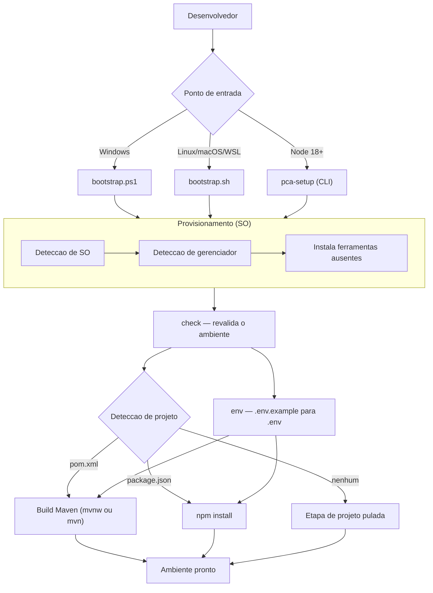

<div align="center">


# PCA Setup

**Bootstrap do zero para o Projeto AMAR.**

Prepara uma maquina limpa — sem Git, Java, Node ou Maven — para rodar o backend e o frontend do sistema.


</div>

---

Provisionador **bare-metal** que instala todo o toolchain necessario e prepara o projeto automaticamente. Funciona numa maquina recem-formatada: detecta o que falta, instala via gerenciador nativo do sistema operacional, configura as variaveis de ambiente e compila o projeto. Idempotente por design — pode ser executado quantas vezes forem necessarias sem efeitos colaterais.

## Features

| Feature | Description |
|---|---|
| **Bare-Metal** | Roda em maquina limpa, sem nenhum pre-requisito instalado |
| **Zero Dependencia** | `bootstrap.ps1` e `bootstrap.sh` usam apenas Powershell e bash, sem instalar nada antes |
| **Deteccao de SO** | Windows (winget/choco/scoop), Linux (apt/dnf/yum/pacman/zypper/apk) e macOS (brew) |
| **Java JDK 21** | Instala Eclipse Temurin (Windows/macOS) ou OpenJDK (Linux) automaticamente |
| **Gate de Versao do JDK** | Rejeita JDKs antigos em vez de deixar o build do Spring Boot 4 quebrar em silencio |
| **Node.js e Maven** | Instala Node LTS quando ausente; usa o wrapper `mvnw` do projeto antes de considerar instalar o Maven |
| **Deteccao de Projeto** | Identifica `pom.xml` (Maven) e `package.json` (Node) na pasta atual |
| **Build Automatico** | Usa o wrapper `mvnw` quando disponivel, com fallback para o `mvn` do sistema |
| **Hospedagem em Docker** | `hosting` sobe a stack de producao (MySQL + Spring Boot + nginx) com TLS automatico |
| **Docker no Windows** | Habilita WSL2 e VirtualMachinePlatform, detectando VT-x desligada antes de tentar |
| **Segredos Reais** | Gera `JWT_SECRET`, `SECURITY_PEPPER` e senhas do banco com aleatoriedade criptografica |
| **Verificacao de Saude** | Aguarda o healthcheck e sonda os endpoints, incluindo o fallback de rota da SPA |
| **Idempotente** | Nunca sobrescreve `.env` existente sem permissao explicita |
| **Multiplataforma** | Windows, Linux, macOS e WSL com o mesmo comportamento |

## Quick Start

### Pre-requisitos

Nenhum. Em Windows, apenas o Powershell (nativo no sistema). Em Linux/macOS, apenas `bash` e `curl`. O script instala todo o restante.

### Configuracao

Clone o repositorio e execute o bootstrap **na raiz do projeto** que deseja preparar:

```bash
git clone https://github.com/projeto-ong-amar/pca-setup.git
cd pca-setup

# Linux / macOS / WSL
cp bootstrap.sh ~/projeto-ong-amar-backend/ && cd ~/projeto-ong-amar-backend
./bootstrap.sh
```

```powershell
# Windows
Copy-Item .\bootstrap.ps1 C:\projeto-ong-amar-backend\bootstrap.ps1
cd C:\projeto-ong-amar-backend
.\bootstrap.ps1
```

> Se o Powershell bloquear a execucao do script, rode uma unica vez:
>
> ```powershell
> Set-ExecutionPolicy -Scope CurrentUser -ExecutionPolicy RemoteSigned
> ```

### Executar

```bash
# Windows — instala o que falta e compila o projeto
.\bootstrap.ps1

# Linux / macOS / WSL
./bootstrap.sh
```

### Opcoes

```powershell
.\bootstrap.ps1 -SkipProvision    # nao instala ferramentas do sistema
.\bootstrap.ps1 -SkipBuild        # baixa deps do Maven sem compilar
.\bootstrap.ps1 -SkipDatabase     # nao instala MySQL
.\bootstrap.ps1 -ForceEnv         # sobrescreve o .env
.\bootstrap.ps1 -JavaVersion 21   # outra versao do JDK
```

```bash
./bootstrap.sh --skip-provision
./bootstrap.sh --skip-build
./bootstrap.sh --skip-database
./bootstrap.sh --force-env
./bootstrap.sh --java 21
```

### CLI Node.js

Disponivel para quem ja tem Node instalado e prefere subcomandos:

```bash
npm install
npm link          # torna 'pca-setup' global
```

## Commands

| Comando | Descricao |
|---|---|
| `pca-setup check` | Verifica pre-requisitos e detecta o tipo de projeto — nao instala nada |
| `pca-setup provision` | Instala Git, Java JDK, Node.js e MySQL ausentes; Maven apenas se nao houver wrapper `mvnw` |
| `pca-setup env` | Cria `.env` a partir de `.env.example` |
| `pca-setup hosting` | Prepara e sobe a stack de hospedagem em Docker (MySQL + Spring Boot + nginx) |
| `pca-setup setup` | Fluxo completo: provisiona o sistema e prepara o projeto |
| `pca-setup setup -y` | Modo nao-interativo (util para CI) |
| `pca-setup setup --skip-provision` | Prepara apenas o projeto, sem tocar no sistema |
| `pca-setup setup --skip-build` | Baixa as dependencias do Maven sem compilar |
| `pca-setup env --force` | Sobrescreve o `.env` existente |

## Hospedagem

O comando `hosting` cuida do deploy completo: garante o Docker, gera o `.env`
com segredos aleatorios, sobe os containers e verifica se a aplicacao
responde de verdade.

```bash
# Teste local: HTTP, sem dominio, sem certificado
pca-setup hosting --domain localhost

# Producao: HTTPS com Let's Encrypt
pca-setup hosting --domain amar.org.br --email voce@seudominio.com
```

A stack precisa estar numa pasta com `docker-compose.yml`. Por padrao o `hosting`
procura em `stack/`, `../deploy`, `deploy/` e na propria pasta atual; use
`--stack <dir>` para apontar explicitamente.

### Opcoes

| Opcao | Descricao |
|---|---|
| `-y, --yes` | Nao perguntar (modo nao-interativo) |
| `--stack <dir>` | Pasta com o `docker-compose.yml` |
| `--domain <domain>` | Dominio de producao; `localhost` roda em HTTP sem certificado |
| `--email <email>` | E-mail do Let's Encrypt |
| `--skip-provision` | Nao instala nem inicia o Docker |
| `--skip-up` | Gera o `.env` sem subir containers (util sem Docker) |
| `--no-build` | Sobe sem reconstruir as imagens |
| `--force-env` | Regera o `.env` da stack |
| `--recreate` | Recria os volumes — **apaga o banco de dados** |
| `--down` | Derruba a stack |
| `--down-volumes` | Com `--down`, remove tambem os volumes |

### Arquitetura da stack

Frontend e API saem pelo **mesmo dominio**, com o nginx fazendo proxy de
`/api/*` para o Spring Boot. Isso e decisivo: o cookie de sessao `authToken` e
emitido com `SameSite=Strict` (`UsuarioController.java:87`), entao em dominios
distintos o navegador nao enviaria o cookie e o usuario seria deslogado a cada
chamada. Servir tudo junto torna as requisicoes same-origin e dispensa
qualquer alteracao no codigo de seguranca.

```
Internet ──HTTPS──> nginx (container frontend)
                     ├── /api/*  ──> Spring Boot :8080  (backend)
                     └── /*      ──> build estatico do Vite
                                      MySQL 8 (rede interna)
```

### Sequencia no Windows

O `hosting` automatiza o WSL2, mas um reinicio do Windows e inevitavel porque
o recurso `VirtualMachinePlatform` so passa a valer depois dele:

```powershell
# 1) Como Administrador: habilita WSL2 e instala o Docker Desktop
pca-setup hosting --domain localhost

# 2) Reinicie o Windows e inicie o Docker Desktop

# 3) No terminal comum, suba a stack
pca-setup hosting --domain localhost
```

> O Hyper-V **nao** e necessario e nem existe na edicao Home do Windows 11. O
> WSL2 usa apenas o `VirtualMachinePlatform`. O `hosting` verifica se a VT-x esta
> ligada na firmware antes de comecar, porque desligada isso nao tem solucao por
> script — seria preciso entrar no BIOS.

### Verificacoes pos-deploy

Apos subir, o comando sonda os endpoints e falha se algum nao responder:

| Endpoint | Verifica |
|---|---|
| `/api/csrf` | proxy do nginx ate a API e o perfil `prod` |
| `/` | entrega do bundle do Vite |
| `/redefinir-senha?token=...` | fallback de rota da SPA, exigido pelo link de e-mail |
| `/api/swagger-ui/index.html` | documentacao da API |

## Architecture



### Etapas do Setup

| Etapa | Responsabilidade |
|---|---|
| **Provision** | Detecta o SO e o gerenciador de pacotes, instala Git, Java JDK, Node.js e MySQL ausentes; o Maven so e instalado quando o projeto nao tem `mvnw` |
| **Check** | Revalida o ambiente e identifica o tipo de projeto na pasta atual |
| **Env** | Copia `.env.example` para `.env`, preservando o arquivo existente |
| **Deps** | Executa `npm install` (ou pnpm/yarn, conforme `packageManager` declarado) |
| **Build** | Executa `./mvnw clean package`, ou apenas `dependency:go-offline` com `--skip-build` |

### Deteccao de Ferramentas

| Ferramenta | Versao | Windows | Linux | macOS |
|---|---|---|---|---|
| **Git** | latest | `Git.Git` / choco / scoop | apt / dnf / yum / pacman / zypper / apk | brew |
| **Java JDK** | 21 (Temurin) | `EclipseAdoptium.Temurin.21.JDK` | `openjdk-21-jdk` | `temurin@21` |
| **Node.js** | LTS | `OpenJS.NodeJS.LTS` | `nodejs` | `nodejs` |
| **Maven** | 3.9.x | *wrapper `mvnw` — ver nota* | `maven` | `maven` |
| **MySQL** | 8 | `Oracle.MySQL` | `mysql-server` | `mysql` |

A ordem de preferencia no Windows e `winget` > `choco` > `scoop`. No Linux, o gerenciador e detectado por `apt-get`, `dnf`, `yum`, `pacman`, `zypper` ou `apk`, nessa ordem. O macOS usa `brew`.

> **Nota sobre o Maven:** o Maven **nao possui pacote no repositorio do winget** (verificado com `winget search --id Apache.Maven --exact`). Por isso o `pca-setup` prioriza o **wrapper `mvnw` versionado no projeto**, que baixa o Maven proprio sem instalar nada no sistema. Em projetos sem wrapper, o Maven e instalado via `choco install maven` (ou `apt`/`dnf`/`brew` no Unix). Com apenas winget disponivel e sem wrapper, o script orienta a instalar o Chocolatey em vez de tentar um ID inexistente.
>
> O Scoop exige `scoop bucket add java` antes de instalar o Temurin, porque o JDK nao esta no bucket principal. O script faz isso automaticamente.

### Comportamento do Gate de Versao do JDK

O `check` considera o Java valido apenas quando `javac` existe **e** a versao e maior ou igual a exigida pelo projeto. Sem esse gate, uma maquina com JDK 11 passaria na verificacao e o build do Spring Boot 4 falharia depois, com um erro dificil de interpretar.

| Situacao | Comportamento |
|---|---|
| `javac` ausente | Instala o JDK requerido |
| JDK abaixo da versao requerida | Instala o JDK requerido e mantem o antigo intacto |
| JDK na versao requerida ou superior | Considera o ambiente pronto |
| Apenas JRE (sem `javac`) | Instala o JDK, pois `javac` e obrigatorio para compilar |

## Tech Stack

| Componente | Tecnologia |
|---|---|
| Linguagem | JavaScript (ESM) |
| Runtime | Node.js 18+ (CLI opcional) |
| CLI | Commander 12.1.0 |
| Execucao | Execa 9.5.1 |
| Prompt | Inquirer 12.1.0 |
| Saida colorida | Chalk 5.3.0 |
| Bootstrap Windows | PowerShell 5.1 (sem dependencia) |
| Bootstrap Unix | Bash 4+ (sem dependencia) |
| Gerenciadores | winget, Chocolatey, Scoop, apt, dnf, yum, pacman, zypper, apk, Homebrew |
| Licenca | MIT |

## Project Structure

```
pca-setup/
├── bootstrap.ps1              # Entrada Windows (zero dependencia, PowerShell 5.1+)
├── bootstrap.sh               # Entrada Linux/macOS/WSL (zero dependencia, bash)
├── bin/
│   └── pca-setup.js           # CLI Node.js (check, provision, env, hosting, setup)
├── lib/
│   ├── commands/
│   │   ├── check.js           # Verificacao de pre-requisitos e do tipo de projeto
│   │   ├── provision.js       # Orquestracao do provisionamento do sistema
│   │   ├── env.js             # Criacao do .env a partir do .env.example
│   │   ├── hosting.js         # Fluxo de deploy em Docker + healthcheck
│   │   └── setup.js           # Fluxo completo (provision + check + env + build)
│   └── utils/
│       ├── format.js          # Saida colorida no console (chalk)
│       ├── fs.js              # Leitura de arquivos e package.json
│       ├── run.js             # Execucao de comandos, deteccao de versoes, stdout+stderr
│       ├── pkgmgr.js          # Deteccao e uso de gerenciadores de pacotes do SO
│       ├── provisioners.js    # Regras de instalacao por ferramenta
│       ├── hosting.js         # Stack Docker: .env, secrets, compose, healthcheck
│       └── project.js         # Deteccao de projeto e execucao de build
├── package.json               # Manifesto e dependencias da CLI
├── LICENSE
└── README.md
```

## Notas Importantes

- **PATH apos instalar**: ferramentas instaladas durante o processo podem nao aparecer no terminal atual. Reinicie o terminal e rode `check` novamente para confirmar.
- **Privilegios**: no Windows, execute como Administrador para evitar falhas de instalacao global. No Linux/macOS o `sudo` e solicitado automaticamente.
- **JAVA_HOME**: em Linux/macOS o pacote do OpenJDK ja registra o `JAVA_HOME`. No Windows, o Temurin tambem configura `JAVA_HOME` e o PATH.
- **Nao destrutivo**: o script nunca apaga arquivos do projeto. O unico arquivo que pode ser substituido e o `.env`, e apenas com `--force-env` explicito.
- **Deteccao por exit code**: `wsl`, `docker` e outros executaveis do Windows emitem mensagens localizadas (e o `wsl` ainda em UTF-16LE). Por isso o `hosting` decide se um servico responde pelo codigo de saida, nunca por regex sobre o texto.
- **`--recreate` e destrutivo**: recria os volumes e apaga o banco de dados. Use com cuidado.
- **`.env` da stack**: nunca versionar. O `deploy/.gitignore` cobre isso, mas confira antes de rodar `git add`.

## License

MIT
